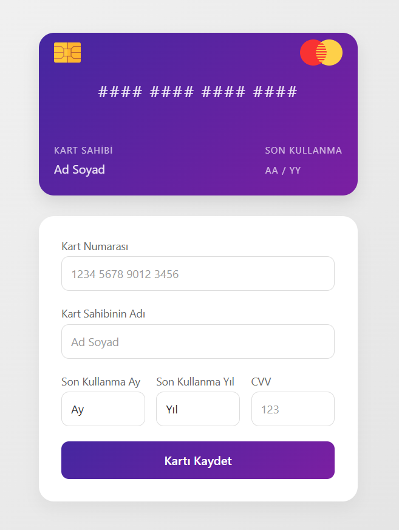

# Credit Card Project

Modern ve interaktif bir kredi kartı form uygulaması. Kullanıcılar kart bilgilerini girerken, gerçek zamanlı olarak kart görselinin güncellendiğini görebilirler.



## 🚀 Özellikler

- Gerçek zamanlı kart bilgisi güncelleme
- Kart çevirme animasyonu
- Otomatik kart numarası formatlama
- Responsif tasarım
- Form validasyonu
- Modern UI/UX

## 💻 Kullanılan Teknolojiler

- HTML5
- CSS3
- JavaScript (Vanilla)
- Font Awesome Icons

## 🛠️ Kurulum

1. Repoyu klonlayın

```bash
git clone https://github.com/keremerkengel/credit-card-project.git
```

2. Proje dizinine gidin

```bash
cd credit-card-project
```

3. index.html dosyasını bir tarayıcıda açın

## 📁 Proje Yapısı

```
credit-card-project/
│
├── index.html
├── style.css
├── script.js
│
├── images/
│   ├── chip.png
│   └── mastercard.png
│
└── README.md
```

## 🎯 Kullanım

1. Kart numaranızı girin (otomatik olarak formatlanacaktır)
2. Kart sahibinin adını girin
3. Son kullanma tarihini seçin
4. CVV numarasını girin (kart otomatik olarak dönecektir)
5. "Kartı Kaydet" butonuna tıklayın

## ✨ Özellikler Detayı

- **Kart Numarası Formatlama**: Otomatik olarak 4'lü gruplar halinde formatlanır
- **CVV Kontrolü**: Mouse CVV alanına geldiğinde kart otomatik olarak döner
- **Gerçek Zamanlı Güncelleme**: Girilen bilgiler anında kart görseline yansır
- **Form Validasyonu**: Tüm alanlar için gerekli kontroller yapılır

## 📞 İletişim

Kerem Erkengel - [GitHub](https://github.com/keremerkengel)

Proje Linki: [https://github.com/keremerkengel/credit-card-project](https://github.com/keremerkengel/credit-card-project)

## 🙏 Teşekkürler

- [Font Awesome](https://fontawesome.com) - ikonlar için
